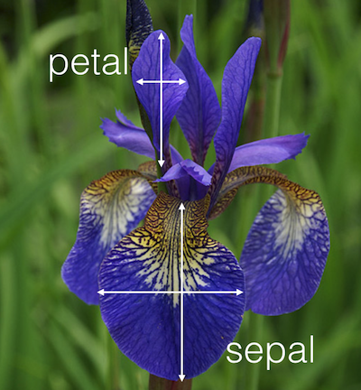

```{r, echo=FALSE, purl=FALSE, message=FALSE}
library(lattice)
library(ggplot2)
knitr::opts_chunk$set(results='hide', comment = "#>", purl = FALSE)
```

# Alternatives: R base graphis and `lattice` graphs {#baseplot} 

> Learning Objectives
>
> * Make a plot with base plot package
> * Make a plot with other base plot commands
> * Make a simple plot with R lattice package
> * Explain the difference to the ggplot approach and evaluate pros and cons

------------

## R base graphics

We will use a simple dataset that comes with the base R install.

```{r car-data, results='show'}
head(cars)
```

R base comes with a simple plot command that can be applied to the data like that: 

```{r plot-cars}
plot(cars)
```


Other things one can do with plot. 

Walk through `plot` arguments and options. 

How to do multiple plots.

https://www.stat.auckland.ac.nz/~paul/RGraphics/chapter1.pdf and code: https://www.stat.auckland.ac.nz/~paul/RGraphics/chapter1.html

> Challenge: make a  plot

> Challenge: how would you do this with ggplot?

```{r ggplot-cars, eval=FALSE, echo=FALSE}
ggplot(cars, aes(speed, dist)) + geom_point()
```


Other base package plot commands: `histogram`, `boxplot`, `stripchart`, `barplot`, `mosaicplot`, `dotchart` and more.

http://www.cyclismo.org/tutorial/R/plotting.html and 
http://www.cyclismo.org/tutorial/R/intermediatePlotting.html

https://www.harding.edu/fmccown/r/

http://courses.atlas.illinois.edu/spring2017/STAT/STAT200/RProgramming/Plotting.html

> Challenge: use some of these commands


## `lattice` package

Lattice is another major graphic package in R. [... more about it here...] It works like this:

```{r lattice-cars, fig.height=4}
xyplot(dist ~ speed, cars)
```


Iris data example (again, other data??) :
```{r iris-data, results='show'}
head(iris)
```

Contains 50 samples from 3 species with 4 measurements: length and width of petals and length and width of sepals. 

```{r iris-photo, echo=FALSE, results='asis', out.width='30%', fig.cap='Iris Petal and Sepal (Source: kaggle.com)', eval=TRUE}

```


With  `lattice`
```{r lattice-iris}
xyplot(Petal.Length~Petal.Width, data = iris, groups=Species, 
  panel = panel.superpose, type = c("p", "smooth"), span=.75,
  col.line = trellis.par.get("strip.background")$col,
  col.symbol = trellis.par.get("strip.shingle")$col,
  key = list(title="Iris Data", x=.15, y=.85, corner=c(0,1), border=TRUE,
        points = list(col=trellis.par.get("strip.shingle")$col[1:3],
                 pch = trellis.par.get("superpose.symbol")$pch[1:3],
                 cex = trellis.par.get("superpose.symbol")$cex[1:3]),
                 text = list(levels(iris$Species))))
```

The same with ggplot:

```{r ggplot-iris, warning=FALSE, message=FALSE}
ggplot(data=iris, aes(x=Petal.Width, y=Petal.Length, color=Species)) +
  geom_point() +
  stat_smooth(aes(jitter(Petal.Width), jitter(Petal.Length)), size=.2, se=F) +
  theme_classic()
```

pros - cons?

More about `lattice`:

https://www.stat.auckland.ac.nz/~paul/RGraphics/chapter4.pdf
R code: https://www.stat.auckland.ac.nz/~paul/RGraphics/chapter4.html
